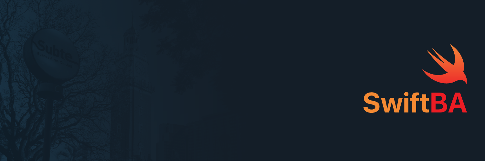

## Meetups 

## 2018 

### Mayo 
4 de Mayo en La Maquinita

- [Mariano Abdala](https://twitter.com/marianoabdala): MVVM + ReactiveCocoa
[🎥](https://vimeo.com/268170421)

- [Federico Jordán](https://twitter.com/FedeJordan90): UITesting con FBSnapshotTestCase
[🎥](https://youtu.be/uuuw-vRrDH4?t=3177)

- [Francisco Reynolds](https://twitter.com/francisreynolds): ReSwift
[🎥](https://youtu.be/uuuw-vRrDH4?t=5051)

### Agosto
16 de Agosto en Digital House
- [Marcos Griselli](https://twitter.com/marcosgriselli): Evolucionando con Swift

- [Luciano Polit](https://twitter.com/lucianopolit): Mejorando nuestro Network Stack

- [Federico Trimboli](https://twitter.com/FedeTrimboli) y [Nahuel Zapata](https://twitter.com/iNahuelZapata): Server Side Swift con Vapor

### Noviembre
1 de Noviembre en [Wolox](https://twitter.com/wolox)

- [Ignacio Oroná](https://twitter.com/theMobArchitect): Introducción a MVP

- [Guido Marucci Blas](https://twitter.com/guidomb): Armando un chatbot en Swift
[🎥](https://www.youtube.com/watch?v=tUTb0UIwQg4)

### Diciembre
6 de Diciembre en [intive-FDV](https://twitter.com/intive_FDV)

- [Fernando Frassia](https://twitter.com/FerFrassia): Animando con SpriteKit.
[🎥](https://www.youtube.com/watch?v=xV6lZY2QiJo)

- [Matias Valdes](https://twitter.com/ValdesMatias): Siri Shortcuts.
[🎥](https://www.youtube.com/watch?v=Wwi18XM4Xa4)

## 2019 

### Marzo 
21 de Marzo en [OLX](https://twitter.com/olxtecharg)

- [Julio Carrettoni](https://twitter.com/dev_jac): Enums, el bueno, el malo y el default
[🎥](https://www.youtube.com/watch?v=os8a6POzF90)

- [Daniela Paula Riesgo](https://github.com/danielariesgo): Reutilizar código: Baby steps para hacer un framework
[🎥](https://www.youtube.com/watch?v=tIagYPQl3-c)

Link: https://www.meetup.com/SwiftBA/events/258928946/

### Junio

26 de Junio en [Mercado Libre](https://twitter.com/Mercadolibre)

- [Joel Marquez](https://twitter.com/joelmarquez90): SOLID Swift
[🎥](https://www.youtube.com/channel/UCFY_bNfneCoxrV1T0xhyejg)

- [Tomás De Lucca](https://twitter.com/tomidelucca): WWDC Experience
[🎥](https://www.youtube.com/channel/UCFY_bNfneCoxrV1T0xhyejg)

- Santiago Lazzari y Leandro Furyk: Nueva Arquitectura Mobile
[🎥](https://www.youtube.com/channel/UCFY_bNfneCoxrV1T0xhyejg)

## Organizadores

- [Pablo Villar](https://twitter.com/volbap)
- [Marcos Griselli](https://twitter.com/marcosgriselli)

## Más de SwiftBA

[Unite a nuestro grupo en MeetUp 🗓](https://www.meetup.com/es/SwiftBA/)
